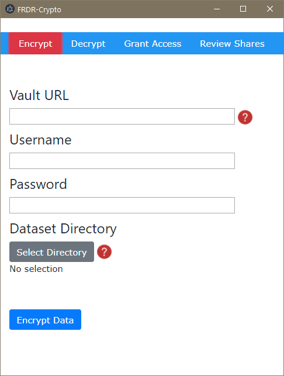
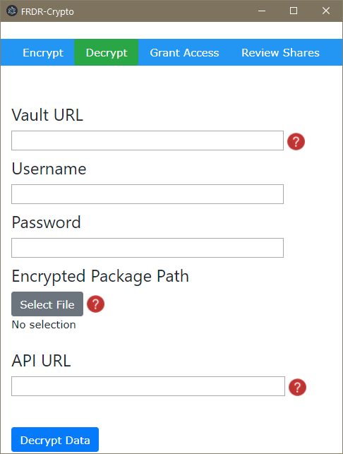
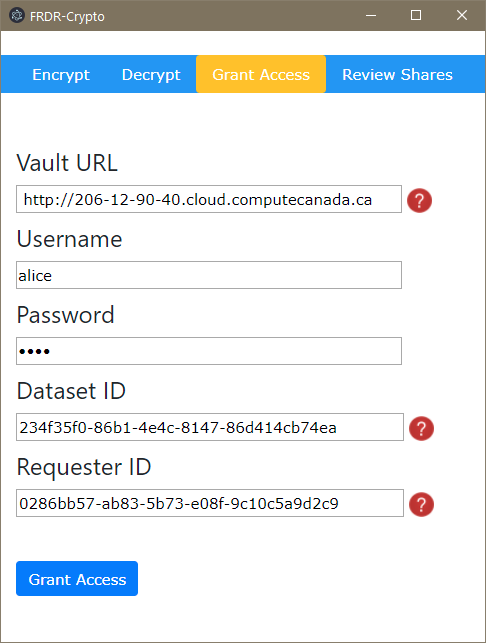
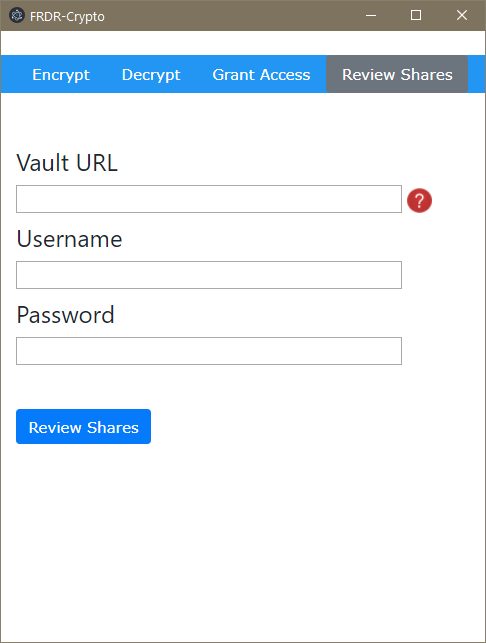
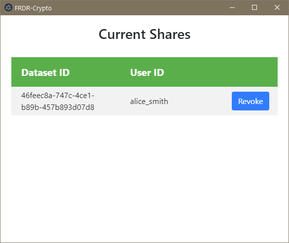

# FRDR Secure Data Desktop Client

## Getting Started

Python 3 is required to run the FRDR Vault client from the command line. Ensure that the output of `python3 --version` shows 3.6 or higher.  

You may want to run inside a virutal environment (see below) before running this command.
```sh
pip install -r requirements.txt
```

Run inside a virtual environment:
```sh
python3 -m venv env
source env/bin/activate
```
at this point you should see (env) to the right of your command prompt, showing you that you are running inside a virtual environment.  You can now check the version of Python inside this environment:
```sh
python --version
```
And if it's indeed version 3, then install the requirements inside the virtual environment:
```sh
pip install -r requirements.txt
```
To exit the virtual environment:
```sh
deactivate
```

The Electron GUI in /gui should work for development after runing  `cd gui` and `npm install` and `npm start`.

## CLI Usage
### Key Stored Locally
To encrypt a file or a directory,
```sh
$ python crypto.py -e -i <path to the file or dir you want to encrypt> -o <output path to the encrypted file or dir>
```
The output path is optional.

For example,
```sh
$ python crypto.py -e -i ./test_dataset  -o ./test_dataset_enc_local
```
To decrypt a file or a directory,
```sh
$ python crypto.py -d -i <path to the encrypted file or dir> -k <path to the key>
```
The output path is optional.

For example,
```sh
$ python crypto.py -d -i ./test_dataset_enc_local -k e9d63a50-bbdb-42ec-b5dd-3a6ad88b58da_key.pem
```
### Use Hashicorp Vault for Key Management
To encrypt a file or a directory,
```sh
$ python crypto.py -e -i <path to the file or dir you want to encrypt>  -o <output path to the encrypted file or dir> --vault <vault server address> --username <vault username> --password <vault password>
The output path is optional.
```
For example,
```sh
$ python crypto.py -e -i ./test_dataset  -o ./test_dataset_enc_vault/ --vault http://127.0.0.1:8200/ --username bob --password training
```
To decrypt a file or a directory,

```sh
$ python crypto.py -d -i <path to the file or dir you want to encrypt>  -o <output path to the encrypted file or dir> --vault <vault server address> --username <vault username> --password <vault password> --url <api path to fetch the secret>
```
The output path is optional.

For example,
```sh
$ python crypto.py -d -i ./test_dataset_enc_vault/ --vault http://127.0.0.1:8200/ --username bob --password training --url http://127.0.0.1:8200/v1/secret/data/4186db38-9ebe-0512-8c32-4552220324aa/test_dataset
```

#### CLI Usage Patterns
Usage:
```sh
python crypto.py -e -i <input_path> [-o <output_path>] [--vault <vault_addr>] [--username <vault_username>] [--password <vault_password>]
python crypto.py -d -i <input_path> [-o <output_path>] (--key <key_path> | --vault <vault_addr> --username <vault_username> --password <vault_password> --url <API_path>)
python crypto.py --logout_vault
```
Options:
```sh
-e --encrypt           encrypt
-d --decrypt           decrypt
-i <input_path>, --input <input_path>
-o <output_path>, --output <output_path> 
-k <key_path>, --key <key_path>
--vault <vault_addr> using hashicorp vault for key generation and storage
-u <vault_username>, --username <vault_username>
-p <vault_password>, --password <vault_password>
--logout_vault  Remove old vault tokens
--url <API_path>  API Path to fetch secret on vault
```

### Grant Access, Review Shares, and Revoke Access
```sh
$ python access_manager_test.py --mode <access manager mode> --vault <vault server address> --username <vault username> --password <vault password> [--name <dataset uuid>] [--requester <requester entity id on vault>]
```
For example, to grant access
```sh
$ python access_manager_test.py --mode grant-access --vault http://127.0.0.1:8200/ --username "bob" --password "training" --requester 9d32d549-69ac-8685-8abb-bc10b9bc31c4 --name 104a3f2b-de39-4132-9bd6-f2a32499d647
```
To review existing shares
```sh
python access_manager_test.py --mode review-shares --vault http://127.0.0.1:8200/ --username "bob" --password "training"
```
#### CLI Usage Patterns
Usage:
```sh
access_manager_test.py --mode <mode> --vault <vault_addr> --username <vault_username> --password <vault_password> [--requester <requester_vault_entity_id>] [--name <dataset_name>]
```
Options:
```sh
-m <mode>, --mode <mode> grant-access, revoke-access or review-shares
--vault <vault_addr> 
-u <vault_username>, --username <vault_username>
-p <vault_password>, --password <vault_password>
-r <requester_vault_entity_id>, --requester <requester_vault_entity_id>
-n <dataset_name>, --name <dataset_name>
```
## GUI Usage







 

