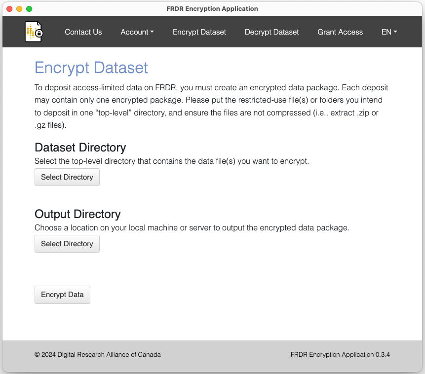
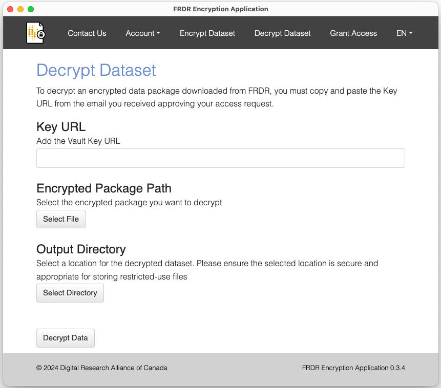

# FRDR Encryption Application

FRDR Encryption Application allows users to encrypt dataset saved on their local machine, with the dataset key encrypted with the data owner's public key. HashiCorp Vault is used as the key server to save the encrypted dataset key and users' public key.

## Getting Started

Python 3 is required to run the FRDR Encryption Application from the command line. Ensure that the output of `python3 --version` shows 3.6 or higher.  

You may want to run inside a virutal environment (see below) before running this command.
```sh
pip install -r requirements.txt
```

Run inside a virtual environment:
```sh
python3 -m venv env
source env/bin/activate (Mac)
. env\Scripts\activate (Windows)
```
at this point you should see (env) to the right of your command prompt, showing you that you are running inside a virtual environment.  You can now check the version of Python inside this environment:
```sh
python --version
```
And if it's indeed version 3, then install the requirements inside the virtual environment:
```sh
pip install -r requirements.txt
```
To exit the virtual environment:
```sh
deactivate
```

The Electron GUI in /gui should work for development after runing  `cd gui` and `npm install` and `NODE_ENV=development npm start`.


## Building
The Python code needs to be built on its target platform using `pyinstaller`:

`pyinstaller -w app_gui.py --distpath gui --add-data './config/config.yml;./config'` (Windows)
`pyinstaller -w app_gui.py --distpath gui --add-data './config/config.yml:./config'` (Mac)

We need to include the config file when generating the bundle.

(On Mac, this also builds a .app version of the Python code, which you'll actually want to delete -- just keep the folder of CLI tools.)

After building the crawler, the GUI can be built from the `gui` subdirectory with:

`electron-packager . --icon=resources/icon.ico` (Windows)

`electron-packager . --icon=resources/icon.icns` (Mac)

On Mac, you can sign for distribution with `electron-osx-sign` and `electron-notarize-cli`, and you need to include the embedded Python binaries:

`IFS=$'\n' && electron-osx-sign frdr-encryption-application-darwin-x64/frdr-encryption-application.app/ $(find frdr-encryption-application-darwin-x64/frdr-encryption-application.app/Contents/ -type f -perm -u+x) --identity [hash] --entitlements=entitlements.plist --entitlements-inherit=entitlements.plist --hardenedRuntime`

`electron-notarize --bundle-id ca.frdr-dfdr.secure --username my.apple.id@example.com --password @keystore:AC_PASSWORD frdr-encryption-application-darwin-x64/frdr-encryption-application.app/`

To build for development on Mac, don't need to create a new key and can ad-hoc code sign 
`cd frdr-encryption-application-darwin-x64/ && codesign --deep --force --verbose --sign - frdr-encryption-application.app/`

Finally, to package for install:

`electron-installer-windows --src frdr-encryption-application-win32-x64/ --dest install/ --config config.json` (Windows)

`hdiutil create tmp.dmg -ov -volname "FRDREncryptionApplication" -fs HFS+ -srcfolder frdr-encryption-application-darwin-x64/ && hdiutil convert tmp.dmg -format UDZO -o FRDREncryptionApplication.dmg && rm tmp.dmg` (Mac)


## Upgrade Dependencies

### Upgrade Python Packages
Upgrade packages and update requirements.txt.
```
pip-upgrade
```

### Update Electron App Dependencies
Upgrade dependencies in package.json and update it.
```
cd gui

## install npm-check-updates if needed
npm install -g npm-check-updates

ncu -u
npm install
```

## CLI Usage
### Encryption
```sh
$ python app_cli.py encrypt \
    --vault <HashiCorp Vault address> \
    --input <path to the dir you want to encrypt> \
    --output <output path to the encrypted package> \
    --oauth
```
The output path is optional.

### Decryption
```sh
$ python app_cli.py decrypt \
    --vault <HashiCorp Vault address> \
    --input <path to the encrypted package> \
    --output <path to put the decrypted package> \
    --url <path to fetch the key saved on the key server> \
    --oauth
```
The output path is optional.

### Granting Access
```sh
$ python app_cli.py grant_access \
    --vault <HashiCorp Vault address> \
    --dataset <dataset ID> \
    --requester <vault ID of the requester> \
    --expire <date this access is going to expire>
    --frdr_api_url <FRDR API base url> \
    --oauth
```

### Show User's Vault ID
This ID is required when users create access request on FRDR.
```sh
$ python app_cli.py show_vault_id \
    --vault <HashiCorp Vault address> \
    --oauth
```

### CLI Usage Patterns
```sh
Usage:
  app_cli.py encrypt --vault=<vault_addr> (--oauth | --username=<un> --password=<pd>) --input=<ip> [--output=<op>] [--loglevel=<l>]
  app_cli.py decrypt --vault=<vault_addr> (--oauth | --username=<un> --password=<pd>) --input=<ip> --url=<key_addr> [--output=<op>] [--loglevel=<l>]
  app_cli.py grant_access --vault=<vault_addr> (--oauth | --username=<un> --password=<pd>) --dataset=<id> --requester=<id> --expire=<date> [--frdr_api_url=<url>] [--loglevel=<l>]
  app_cli.py show_vault_id --vault=<vault_addr> (--oauth | --username=<un> --password=<pd>)
  app_cli.py -h | --help

Options:
  -h --help     Show this screen.
  --username=<un>  username.
  --password=<pd>  password.
  --vault=<vault_addr>
  --input=<ip>
  --output=<op>
  --url=<key_addr>
  --dataset=<id>
  --requester=<id>
  --expire=<date>  the permission expiry date in format YYYY-mm-dd
  --frdr_api_url=<url>
  --loglevel=<l>  loglevel [default: info].
```

## GUI Usage

Users need to log into the key server (Hashicorp Vault) first before using the app. They need to provide the url of the key server and then login with their globus credentials. 


You can use the app as a despostior or a requester. As a depositor, you can encrypt a dataset and grant access of the dataset's key to other users. As a requester, you can generate access request and decrypt encrypted packages downloaded from FRDR. 

### As Depositor



The **Encrypt Dataset** menu option allows you to encrypt any directory on your computer by automatically generating encryption keys, encrypting them with your private key and sending them to Vault which only you have access to these encrypted dataset keys, using those keys to secure the package, and wrapping it in a metadata container called *bagit*. After clicking `Encrypt Data` you'll be prompted to the destination of encrypted package, which you can then upload to a repository such as FRDR.


The **Grant Access** menu option allows you to grant access to a package's encrypted keys on Vault to another user who has requested access. You will need the requester's ID and the package/dataset ID, both of which will normally be included in a private message sent to you along with an access request.

### As Requester

 

You need **Request Access** to retrieve your uuid on key server when you fill out the access request form for a sensitive dataset on FRDR.



The **Decrypt** menu option allows you to decrypt an encrypted package for access. Assuming you've already downloaded the package, clicking `Decrypt Data` will retrieve its encrypted dataset key from a Vault API endpoint URL (which will be normally be provided to you upon acceptance of an access request), decrypt the key with your private key (saved on your local machine) and then decrypt the package with the dataset key. You should only decrypt packages on trusted computers, as their contents may be very sensitive.

## License

FRDR Encryption Application, a local application to encrypt and decrypt data.

Copyright (c) 2024 Digital Research Alliance of Canada

License: GNU General Public License v3.0 (https://www.gnu.org/licenses/gpl-3.0.en.html)

This program is free software: you can redistribute it and/or modify it under the terms of the GNU General Public License as published by the Free Software Foundation, either version 3 of the License, or (at your option) any later version.

This program is distributed in the hope that it will be useful, but WITHOUT ANY WARRANTY; without even the implied warranty of MERCHANTABILITY or FITNESS FOR A PARTICULAR PURPOSE. See the GNU General Public License for more details.

See http://www.gnu.org/licenses/ for full license.
