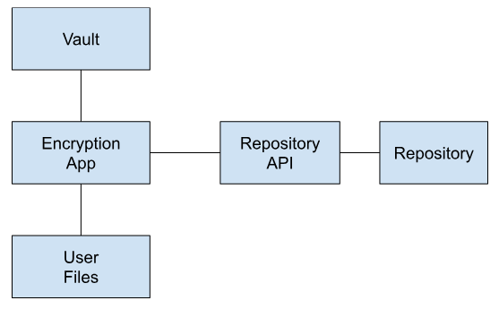

# Deploying the FRDR Encryption App

These instructions are for repository owners interested in building and deploying a custom version of the FRDR Encryption App for their own use.

## System Diagram

## Encrypted Dataset Deposit Workflow

1. Encrypt

* The submitter logs into the encryption app
* The submitter uses the encryption app to encrypt the source data

2. Deposit

* The submitter logs into the data repository
* The submitter starts a new dataset submission
* The submitter supplies all relevant metadata for the dataset
* The submitter uploads the encrypted data package
* The repository curation process is executed and the dataset is published

3. Request access

* The requester finds the published dataset and starts the process to request access
* The requester supplies all required documentation and agreements
* The requester signs the data access agreement

4. Email notification

* The submitter receives email that the requester wants access
* The submitter reviews all documentation and signs the data access agreement

5. Grant access to encrypted data

* The submitter grants the requester access to the encrypted data package within the repository

## Related Documents

* [Configuring the app](CONFIGURING.md)
* [Building the app](BUILDING.md)
* Vault:
  * [Deploying Locally](VAULT_LOCAL.md)
  * [Deploying in AWS](https://github.com/frdr-dfdr/frdr_encryption_client/tree/master/vault_aws)

In order to support the Encryption App operation, a REST API will need to be built within the data repository.  These endpoints are used in `FRDRAPIClient.py`:

* `/requestitem/grant-access/verify`
* `/dataset-title`
* `/uservaultid`
* `/requestitem/decrypt`
* `/requestitem/grant-access`

See the file [RESTAPISampleCode.md](RESTAPISampleCode.md) for sample Java code. See the file [RESTAPIDbSchema.md](RESTAPIDbSchema.md) for sample database objects.

